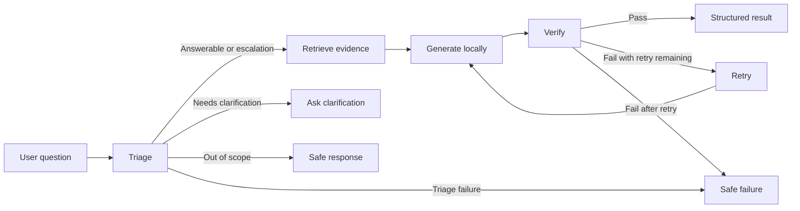
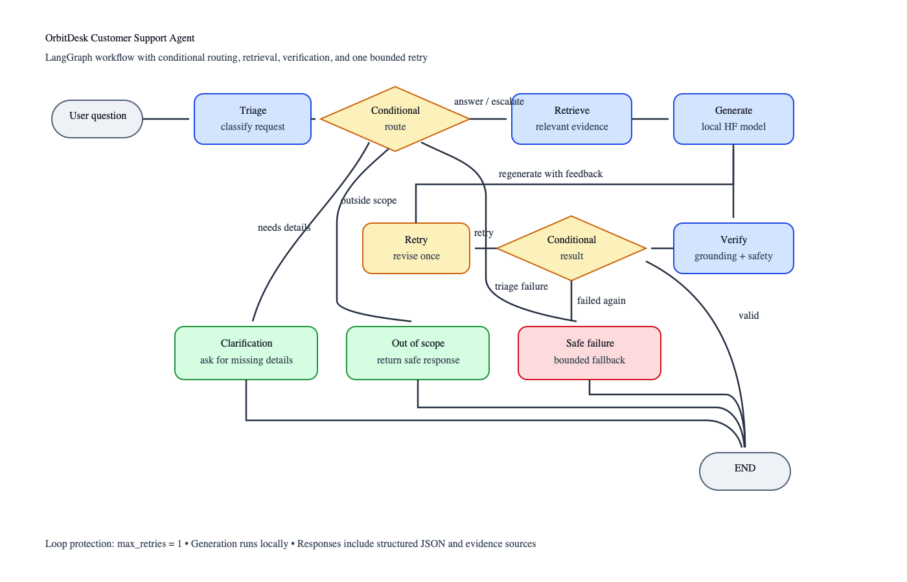

# OrbitDesk Local Support Agent

OrbitDesk is a local-first support agent for a fictional workspace product. It
loads the supplied product documentation and resolved cases, retrieves relevant
evidence, generates a structured answer with a local Hugging Face model, and
verifies that the response is grounded in the retrieved sources.

## Project status

The local workflow and repository artifacts are complete: data loading,
evidence indexing, semantic retrieval with keyword fallback, triage, local
generation, deterministic response construction, verification, bounded retry
routing, safe terminal responses, CLI, tests, five validated sample outputs,
and the required graph image.

## Workflow





Semantic retrieval is attempted first. If it fails, the retrieval node falls
back to deterministic keyword ranking. Superseded cases are excluded, and
current knowledge-base documents take priority over resolved cases.

## Local models

- Embeddings: `sentence-transformers/all-MiniLM-L6-v2`
  - Revision: `1110a243fdf4706b3f48f1d95db1a4f5529b4d41`
- Generation: `Qwen/Qwen2.5-1.5B-Instruct`
  - Revision: `989aa7980e4cf806f80c7fef2b1adb7bc71aa306`

The runtime selects Apple MPS first, then NVIDIA CUDA, and otherwise uses the
CPU. Network access is needed for the initial model download only. Model
revisions are pinned so the same cached artifacts can be reused offline.

### Hardware and measured timings

The submitted sample outputs were generated on:

- Computer: MacBook Air
- CPU: Apple M4, 10 cores (4 performance and 6 efficiency)
- Memory: 16 GB unified memory
- Available accelerator: Apple integrated GPU
- Device selected for the recorded sample run: CPU

Observed warm-cache timings are approximate:

| Operation | Approximate time |
| --- | ---: |
| MiniLM load | 0.09-0.15 seconds |
| Evidence indexing | 0.13-0.26 seconds |
| Qwen load | 0.19-0.22 seconds |
| Generated answer workflow | 37-47 seconds |
| Deterministic terminal route | under 0.01 seconds |

The project was tested with 16 GB RAM. A 16 GB machine is recommended for the
1.5B generation model. The local runtime limits generated responses to 192 new
tokens. On Apple MPS it also caps the process allocator and clears unused MPS
cache after each generation.

## Setup and usage

Python 3.12 is recommended.

```bash
python3 -m venv .venv
source .venv/bin/activate
python -m pip install -r requirements.txt
```

Run the CLI with a question:

```bash
PYTHONPATH=src python -m orbitdesk_support_agent.cli \
  "Can a Viewer create an API credential?"
```

Generate one sample in an isolated process (recommended on machines with
limited unified memory):

```bash
HF_HUB_OFFLINE=1 TRANSFORMERS_OFFLINE=1 PYTHONPATH=src \
  python -m orbitdesk_support_agent.sample_runner --question-id Q-001
```

Repeat with `Q-002` through `Q-005`. Each command replaces that case in
`sample_outputs.json` while preserving the others, and exiting between cases
releases model memory. After the first model download, the offline environment
variables ensure no network access is used.

The runner also supports `--all`, but processing every model-backed case in one
Python process uses more memory and is not recommended on a 16 GB Mac.

Run the tests:

```bash
python -m pytest -q
```

Current result: `33 passed`.

Run the bounded retry/safe-failure routing demonstration directly:

```bash
python -m pytest \
  tests/test_graph.py::test_empty_generation_retries_then_returns_safe_failure \
  -q
```

## Repository contents

- `knowledge_base/`: current OrbitDesk product documentation
- `resolved_cases.json`: historical support cases
- `sample_questions.json`: five supplied workflow questions
- `sample_outputs.json`: locally generated structured responses and traces
- `output_schema.json`: structured response schema
- `docs/orbitdesk-agent-graph.png`: submission-ready graph diagram
- `docs/orbitdesk-agent-graph.svg`: editable graph diagram source
- `scripts/render_graph_diagram.m`: local PNG rendering utility for macOS
- `src/orbitdesk_support_agent/`: agent implementation
- `tests/`: loader, indexer, retrieval, triage, generation, memory, and graph
  routing tests

Knowledge-base documents are the primary source of truth. Resolved cases are
secondary evidence, and cases marked `superseded` must never be presented as
current guidance.

## Design trade-off and known limitation

High-confidence safety and assignment routes are classified deterministically;
uncertain requests fall back to the local language model. Qwen generates the
readable evidence-grounded answer, while Python constructs the response schema
and source references from retrieved records. This avoids malformed JSON from
a small local model and makes the model/code boundary explicit, at the cost of
occasionally including a retrieved source that the answer did not directly use.

The 1.5B model is slow on CPU, taking about 37-47 seconds for the tested
answerable routes. With more time, the retrieval-to-citation step would select
sources at sentence level and generation would be benchmarked with a smaller
quantized model. Execution logs, deterministic verification, one allowed
retry, and a safe-failure node keep failures observable and prevent infinite
loops.

## Submission checklist

- Source, setup instructions, tests, and sample outputs: included
- Exact model names and revisions: included above
- Hardware and measured timings: included above and in sample outputs
- PNG graph diagram: `docs/orbitdesk-agent-graph.png`
- Remaining manual step: record the required 4-7 minute walkthrough
- Remaining manual step: submit the accessible GitHub/video links and diagram
  through the provided Google Form

## AI assistance disclosure

An AI coding assistant was used while developing this assignment for guided
explanations, implementation review, debugging, and documentation. The design
choices and submitted implementation were reviewed incrementally by the
candidate.
