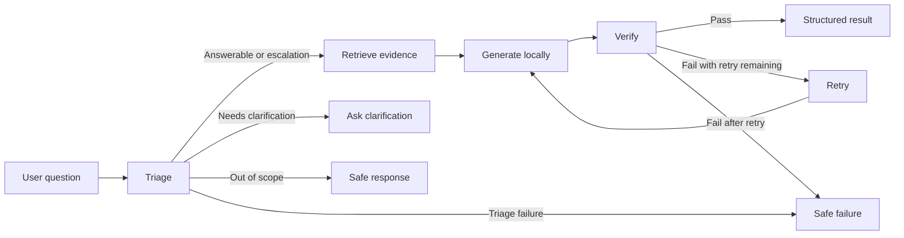

# OrbitDesk Local Support Agent

OrbitDesk is a local-first support agent for a fictional workspace product. It
loads the supplied product documentation and resolved cases, retrieves relevant
evidence, generates a structured answer with a local Hugging Face model, and
verifies that the response is grounded in the retrieved sources.

## Project status

The core local workflow is implemented: data loading, evidence indexing,
semantic retrieval with keyword fallback, triage, generation, verification,
bounded retry routing, safe terminal responses, a CLI, graph tests, and a
five-question sample runner. Final route calibration and submission artifacts
are still being completed.

## Workflow



Semantic retrieval is attempted first. If it fails, the retrieval node falls
back to deterministic keyword ranking. Superseded cases are excluded, and
current knowledge-base documents take priority over resolved cases.

## Local models

- Embeddings: `sentence-transformers/all-MiniLM-L6-v2`
  - Revision: `1110a243fdf4706b3f48f1d95db1a4f5529b4d41`
- Generation: `Qwen/Qwen2.5-1.5B-Instruct`
  - Revision: `989aa7980e4cf806f80c7fef2b1adb7bc71aa306`

The runtime selects Apple MPS first, then NVIDIA CUDA, and otherwise uses the
CPU. Network access is needed for the initial model download only.

## Setup and usage

Python 3.12 is recommended.

```bash
python3 -m venv .venv
source .venv/bin/activate
python -m pip install -r requirements.txt
```

Run the CLI with a question:

```bash
PYTHONPATH=src python -m orbitdesk_support_agent.cli \
  "Can a Viewer create an API credential?"
```

Generate outputs for all five supplied questions:

```bash
PYTHONPATH=src python -m orbitdesk_support_agent.sample_runner
```

Run the tests:

```bash
python -m pytest -q
```

Current result: `14 passed`.

## Repository contents

- `knowledge_base/`: current OrbitDesk product documentation
- `resolved_cases.json`: historical support cases
- `sample_questions.json`: five supplied workflow questions
- `sample_outputs.json`: locally generated structured responses and traces
- `output_schema.json`: structured response schema
- `src/orbitdesk_support_agent/`: agent implementation
- `tests/`: loader, indexer, retrieval, and graph-routing tests

Knowledge-base documents are the primary source of truth. Resolved cases are
secondary evidence, and cases marked `superseded` must never be presented as
current guidance.

## Known limitation

The small local generation model can be conservative during triage and may ask
for clarification when the supplied documentation could answer the question.
The graph behavior remains observable through its execution log, and the
deterministic verifier and bounded retry prevent unsupported answers and
infinite loops.

## AI assistance disclosure

An AI coding assistant was used while developing this assignment for guided
explanations, implementation review, debugging, and documentation. The design
choices and submitted implementation were reviewed incrementally by the
candidate.
